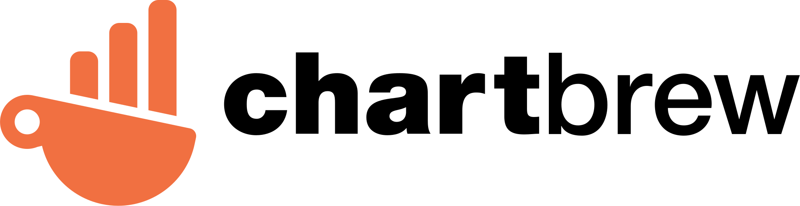
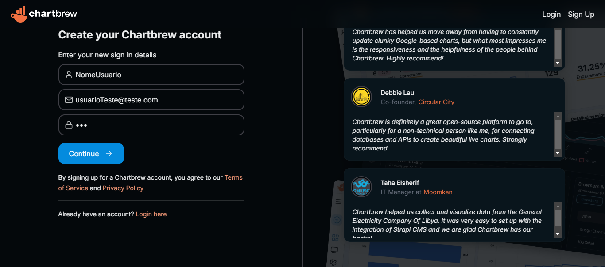
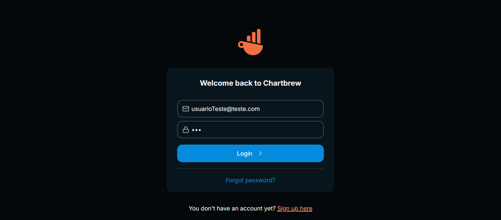
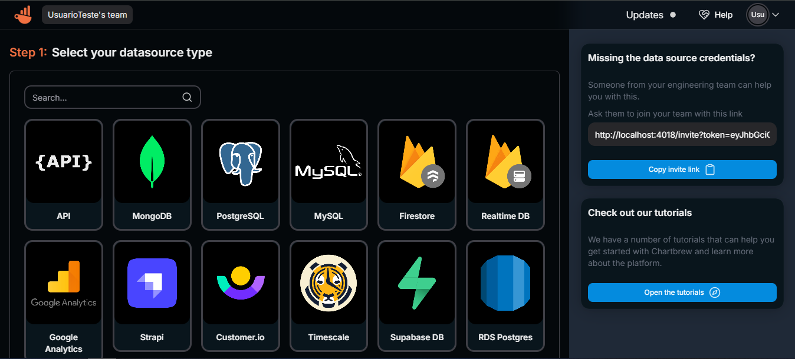

# Chartbrew - MongoDB - Sistema completo



Projeto para Deploy completo de aplicação chartbrew e seu funcionamento completo. O Chartbrew é uma aplicação para criação de dashboards a partir de banco de dados, muito similar ao conceito do PowerBI. O projeto é baseado na imagem [razvanilin/chartbrew](https://hub.docker.com/r/razvanilin/chartbrew) que contém o backend e o frontend do Chartbrew, porém não contempla o Redis (banco de dados intermediário que armazena os templates do chartbrew), o MySQL (armazena os dados vinculados aos usuários) e o MongoDB (banco que seria a base de informações para os dashbaords). Aqui possui o docker compose e os manifestos kubernetes para o deploy da aplicação por completo.

# Conteúdos

- [Clonando projeto localmente](#clonando-projeto-localmente)
- [Deploy com o docker-compose](#deploy-com-o-docker-compose)
- [Deploy com o kubernetes](#deploy-com-o-kubernetes)
- [Tecnologias](#tecnologias)

## Clonando projeto localmente

Link do [Projeto](https://github.com/joseaugusto0/chartbrew-mongoDB-system.git).

- Clone o projeto na pasta desejada utilizando o comando

```
    git clone https://github.com/joseaugusto0/chartbrew-mongoDB-system.git
```

- Ou clone direto pelo Visual Studio Code
  - Segue o [tutorial](https://learn.microsoft.com/en-us/azure/developer/javascript/how-to/with-visual-studio-code/clone-github-repository?tabs=create-repo-command-palette%2Cinitialize-repo-activity-bar%2Ccreate-branch-command-palette%2Ccommit-changes-command-palette%2Cpush-command-palette) de como clonar direto pelo VS Code.

## Variáveis de ambiente a serem definidas no docker compose e/ou manifestos kubernetes

### Chartbrew
- **CB_ENCRYPTION_KEY**: Chave AES de 32 bytes. Para gerá-la com o Node, rodar o comando:
```
    node -e "console.log(require('crypto').randomBytes(32).toString('hex'))"
```
- **CB_API_PORT** = 4019
    - Porta em que a Backend do chartbrew estará rodando. O padrão é a porta 4019, só mudará se você alterar o redirecionamento no manifesto ou no docker compose
- **CB_DB_PORT** = 3306
    - Porta 3306 utilizada para o banco de dados do MySQL. Só mudará se alterado no manifesto ou docker compose 
- **CB_DB_PASSWORD** = admin
    - Está como default "admin", mas altere para a senha para o desejado 
- **CB_REDIS_PORT** = 6379
    - Porta 6379 utilizada para o banco de dados do Redis. Só mudará se alterado no manifesto ou docker compose

### MySQL
- **MYSQL_ROOT_PASSWORD** = admin
    - Como citado anteriormente, a senha padrão do MySQL é "admin", mas altere para a senha desejada nesta variável e a **CB_DB_PASSWORD** nas variáveis do Chartbrew


## Deploy com o docker-compose

- Na pasta raíz do projeto, rodar o seguinte comando:
```
    docker compose up
```

- Caso queira parar os containers, na pasta raíz do projeto também, é só rodar o seguinte comando:
```
    docker compose down
```

## Deploy com o kubernetes
- Precisamos criar o namespace separado para o chartbrew e suas configurações, portanto, vamos rodar o código (da pasta raíz) para gerar esse namespace e aplicar os manifestos na pasta **k8s**:
```
    kubectl create namespace chartbrew
    kubectl apply -f ./k8s/.git
```

## Gerando uma Dash a partir do MongoDb

- O MongoDb estará rodando localmente em **http://localhost:27018**, então precisará inserir dados nele anteriormente. Insira o que ver como necessário para sua aplicação.

- Após alimentado o MongoDb, ir até a UI do chartbrew em **http://localhost:4018** e inserir o seu nome de usuário, um e-mail e senha


- Caso você não seja redirecionado automaticamente para a UI principal do Chartbrew, só realizar o login novamente.


- Após entrar na página principal, do Chartbrew. Você terá as opções de Banco de dados possíveis para você se conectar


- Selecione a opção "MongoDB" para criar uma conexão com o MongoDB.

- Preencha os campos necessários em **Connection form**
    - Nome da conexão: nome que ficará salvo a conexão no chartbrew
    - Host: para a UI observar o MongoDB, insirá o hostname como **host.docker.internal** e a porta **27018**
    - Nome do banco de dados
    - Credenciais do banco, se foi configurado posteriormente

- Clique em "Salvar" para criar a conexão.

- Agora você pode começar a criar seus dashboards usando os dados do MongoDB.

- Para mais informações sobre como usar o Chartbrew, consulte a [documentação](https://chartbrew.com/docs/).

# Tecnologias

As seguintes ferramentas foram usadas na construção do projeto:

- [Docker Desktop](https://docs.docker.com/desktop/install/windows-install/)
- [Rancher Desktop](https://docs.rancherdesktop.io/getting-started/installation)
- [Chartbrew](https://chartbrew.com/)
- [Redis](https://redis.io/)
- [MySQL](https://www.mysql.com/)
- [MongoDB](https://www.mongodb.com/docs/manual/installation/)
- [Kubernetes](https://kubernetes.io/pt-br/)